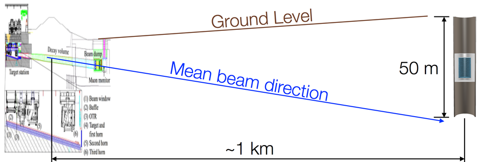
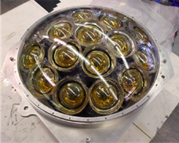
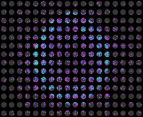

# Hyper Kamiokande TRISEP Machine Learning hands-on session

## Introduction
This repository holds the scripts and classes for the Machine Learning hands-on session at 2025 TRISEP Summer School. We will explore the application of Convolutional Neural Networks to the problem of particle identification in Water Cherenkov Detector.
It is advisable to fork this repository by clicking on a button above in top right corner of the page before proceeding.

## Acknowledgements
I borrowed code liberally from [code and tutorials](https://github.com/WatChMaL) developed by [Kazu Terao](https://github.com/drinkingkazu) and code by [Julian Ding](https://github.com/search?q=user%3Ajulianzding) and [Abhishek Kajal](https://github.com/search?q=user%3Aabhishekabhishek). Big thanks also to the [Water Cherenkov Machine Learning](https://github.com/WatChMaL) collaboration for lending their data - particularly [Nick Prouse](https://github.com/nickwp) for actually running the simulations and to Julian for 'massaging' the data.
Thanks to Wojtek Fedorko for providing this code and for assistance.

## Setting up on triumf-ml1

To access, from a terminal
```
ssh -Y username@triumf-ml1.phas.ubc.ca
```

First time setup, if you forked fill out your GitHub username as [your-username], if not you can use felix-cormier as the username instead:
```
mkdir hk_ml_trisep_tutorial
cd hk_ml_trisep_tutorial
git clone https://github.com/[your-username]/HK_ML_tutorial.git
cd HK_ML_tutorial
```

Every time, once you login, and if you've used the same directory names as above, you'll have to do
```
cd hk_ml_trisep_tutorial/HK_ML_tutorial
source setup_environment.sh
```


 # Project overview and data visualization and streaming tutorial
 

 ## Project Overview
 When going through a water detector, such as Super Kamiokande, neutrinos have a small chance to interact with a water molecule. This will often (but not always!) produce the neutrino's corresponding lepton.
 Due to the Cherenkov effect, the lepton will produce a ring of light, which can be used for both classification and regression.
 In this project we will tackle the task of classification of neutrino type ($\nu_e$ or $\nu_\mu$) or rather the charged leptons resulting from the nuclear scatter ($e$ and  $\mu$) as well as an irreducible background from neutral current $\gamma$ production. The dataset comes from simulated Water Cherenkov detector originally called NuPRISM, now called the Intermediate Water Cherenkov Detector (IWCD), which is part of the complex Hyper Kamiokande Detector currently under construction in Japan. The detector has a cylindrical geometry and can be lowered and raised in a shaft to sample different energy distribution of incoming neutrinos! 

 The cylinder wall or 'barrel' and end-caps are lined with 'multi-PMT' or 'mPMT' modules arranged in a rectangular grid. Each mPMT is a dome with 19 PMTs arranged in two rings and one at the center:

 Here is an event display where the barrel was 'unrolled':
  
 
 You can clearly see a Cherenkov ring appearing
 The 'brightness' corresponds to charge collected by each PMT. Each PMT also tells us the arrival time of the signal.


## Notebook order in the tutorial
The sequence of the tutorial is:
  1. Data Exploration and Streaming
  1. Training with different architectures
  1. Monitoring training and analyzing outputs
  
### Data Exploration and Streaming

The first script we will run will be in the _scripts_ directory, called _data\_exploration.py_.
From your repo directory you can run 
```
python scripts/data_exploration.py
```

This will run this script tutorial-style, going through different lines print lines. We'll also go through the lines here. If you want to skip the tutorial style, you can add the option _-s_ to skip the prompts and print out everything at once.

First, we will open the [.h5 file](https://github.com/felix-cormier/HK_ML_tutorial/blob/trisep_dev/scripts/data_exploration.py#L24)
```python
    f=h5py.File(filepath,"r")
```
.h5 files are very performant when reading from disk, and so are widely used in ML.
The code will open the file and print out the different keys, which are variables labelled with a name.

Next, we'll look at the number of events. We [print out the shape of the 'labels' variable](https://github.com/felix-cormier/HK_ML_tutorial/blob/trisep_dev/scripts/data_exploration.py#L41)

```python
print(f"Number of events: {f['labels'].shape}")
```

